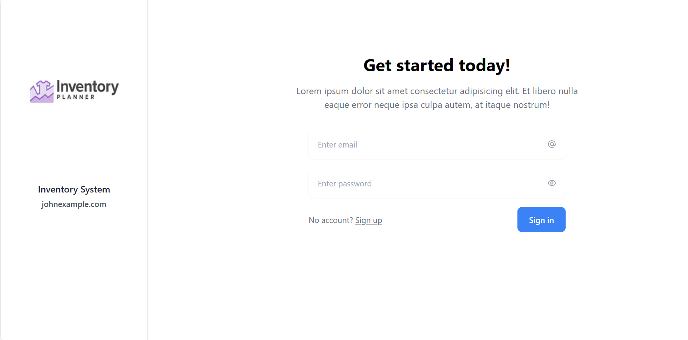
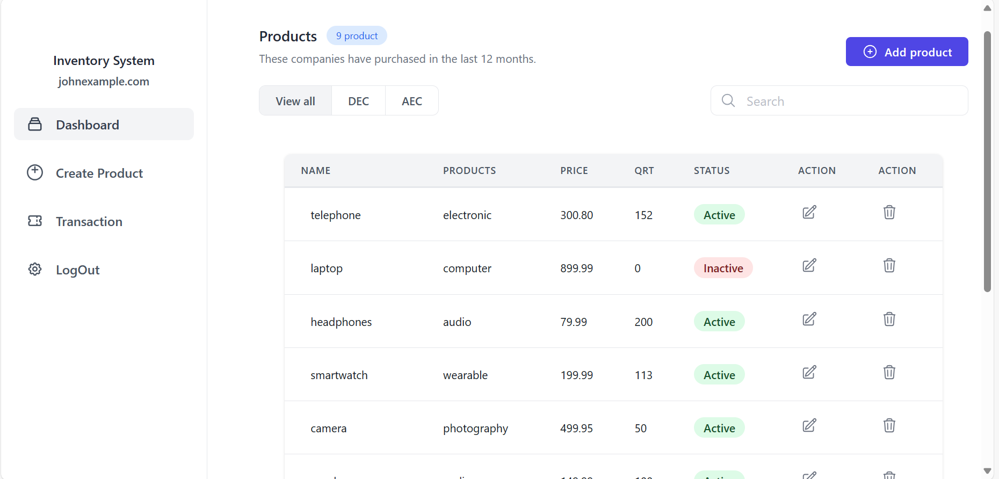
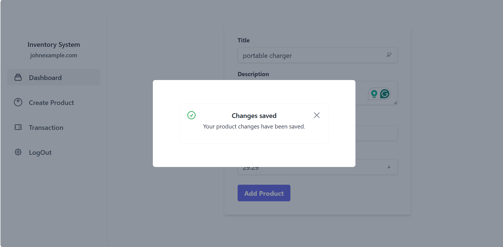
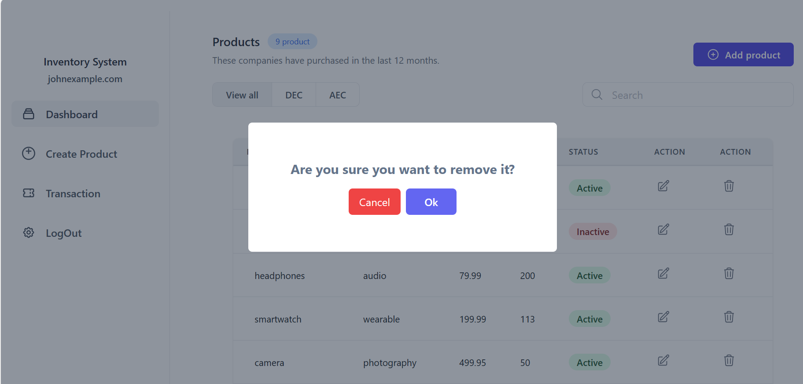
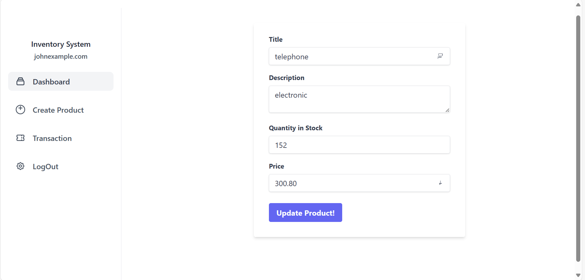
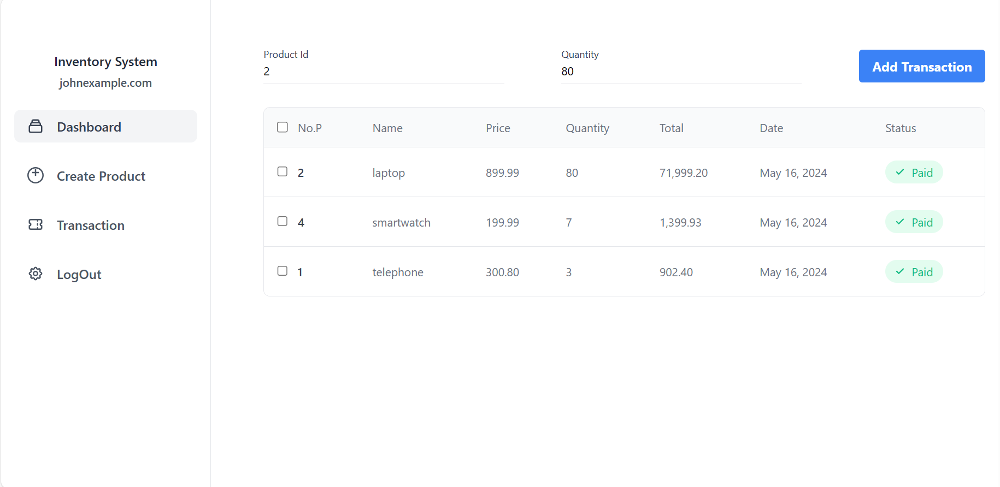
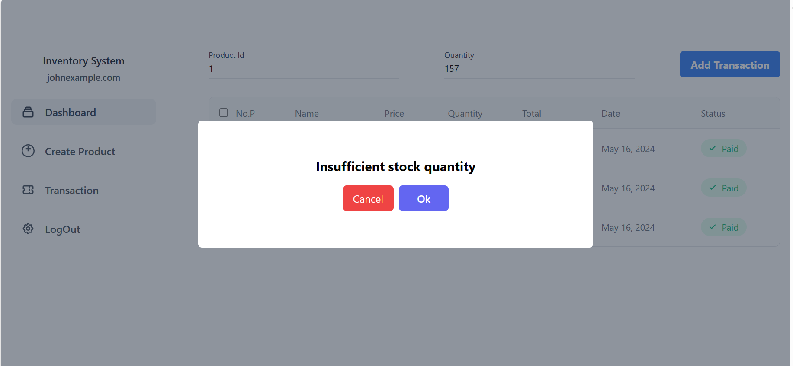

# 📦 Simple Inventory App

The Simple Inventory App is a user-friendly inventory management solution built with Angular for the frontend and NestJS with TypeORM for the backend. It enables users to register, log in, add, update, and delete products, and track transactions.

## 🚀 Key Features:

- 🔐 **User Authentication:** Register and login securely with authentication guards.
- 📝 **Product Management:** Easily add, update, and delete products.
- 🔄 **Transaction Tracking:** Keep track of inventory changes over time.
- 🖥️ **Responsive Interface:** Intuitive dashboard with a responsive design.
- 🔒 **Secure Backend:** Utilizes NestJS and TypeORM for backend security and data management.

## 💻 Technologies Used:

- **Frontend (Angular):** HTML, Tailwind, TypeScript
- **Backend (NestJS with TypeORM):** Node.js, TypeScript
- **Database:**  MySQL
- **Authentication:** JSON Web Tokens (JWT)
- **Other Tools:** Git, GitHub, Postman

## 🛠️ Installation and Usage:

- 🌀 Clone the repository: `git clone https://github.com/WalaaRababa/Full-Stack_Innertory_System`
- 📦 Install dependencies: `npm install`
- ▶️ Start the servers: `npm run start:dev`
 - ▶️ Start the frontend: `ng s`

## 📸 Screenshots:

### Home Page

### Dashboard

### Add Product 

### Remove Product Check

### Update Product 

### Transaction List

### Add Transaction Check
